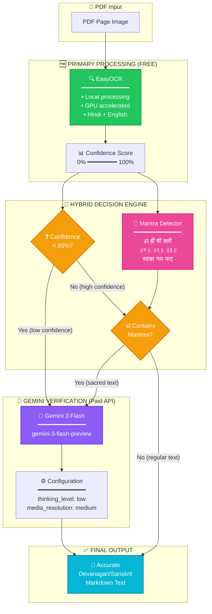
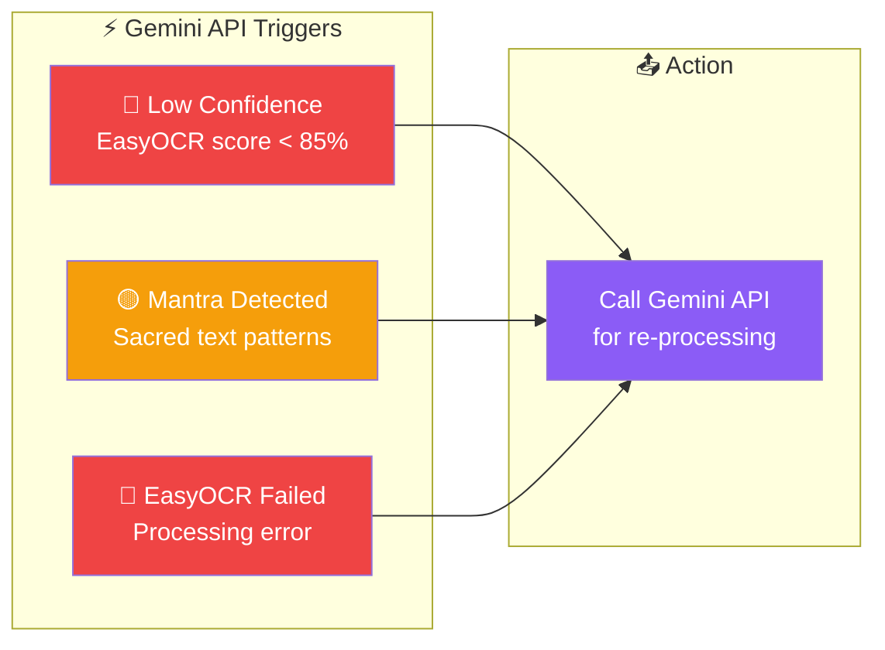
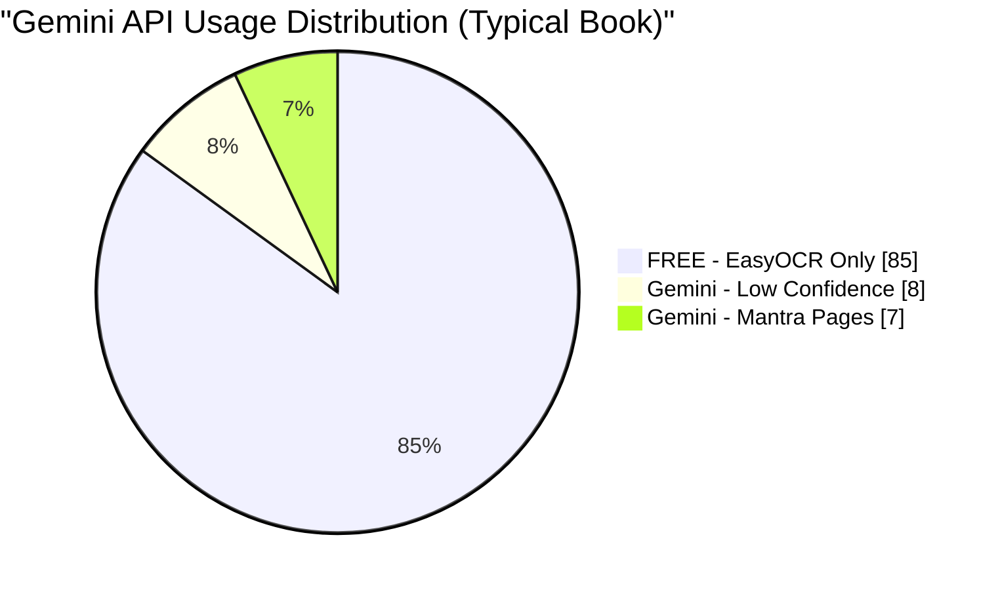
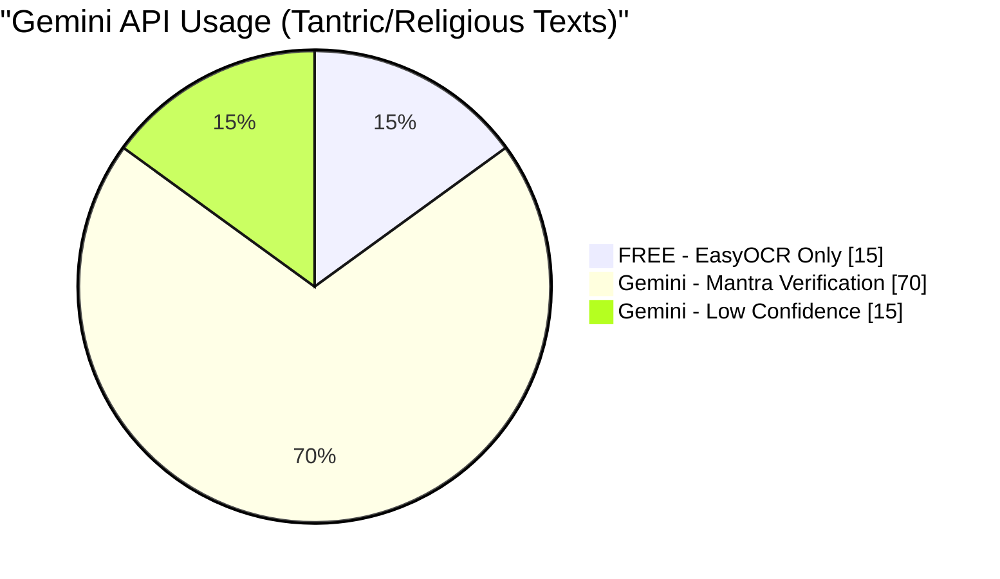
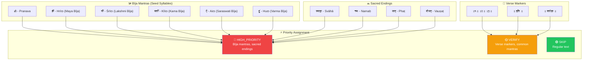
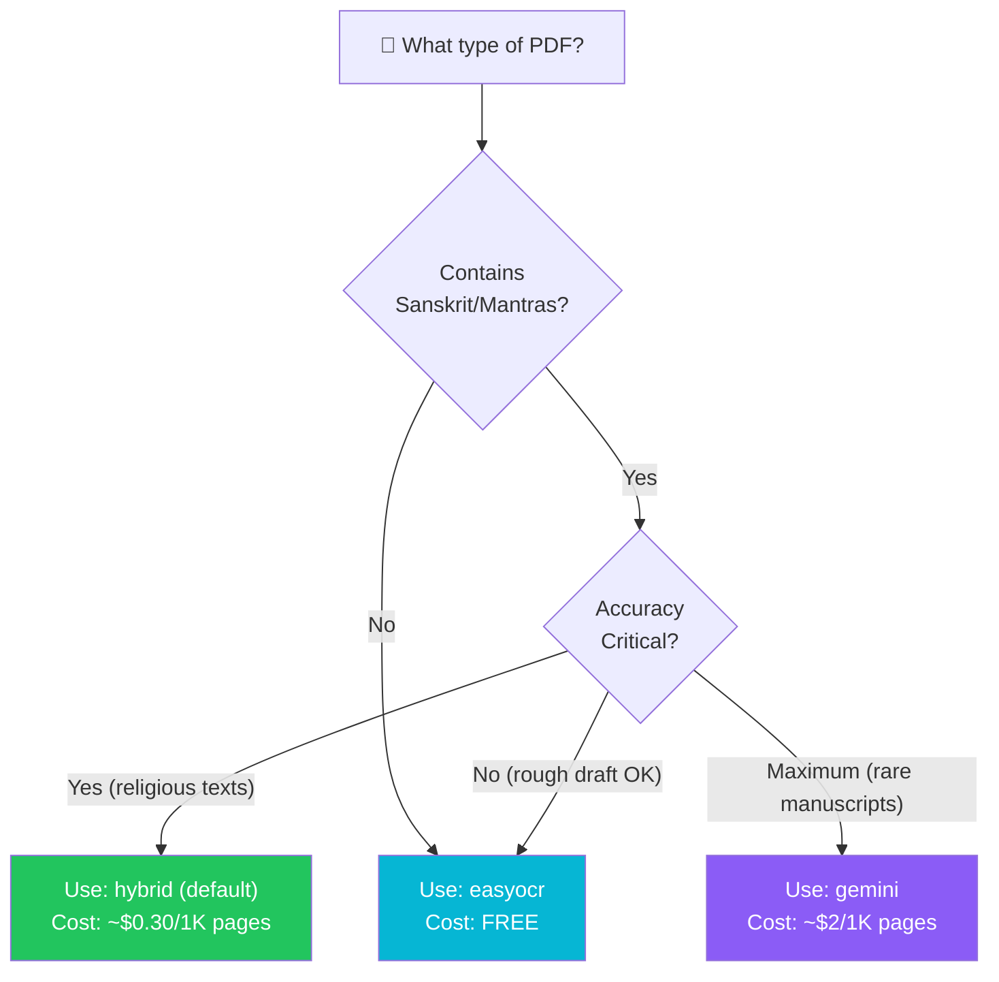

# 🕉️ Hybrid OCR Architecture

> Understanding the Role of Gemini API in Sanskrit/Devanagari OCR

---

## 📋 Table of Contents

- [Overview](#overview)
- [Architecture Diagram](#architecture-diagram)
- [The Hybrid Approach](#the-hybrid-approach)
- [When Gemini API is Called](#when-gemini-api-is-called)
- [Mantra Detection System](#mantra-detection-system)
- [Cost Optimization](#cost-optimization)
- [Configuration Options](#configuration-options)
- [Best Practices](#best-practices)

---

## Overview

The **Hybrid OCR Mode** is the default and recommended approach for processing Hindi/Sanskrit PDFs. It combines:

| Component          | Role                      | Cost                                      |
|--------------------|---------------------------|-------------------------------------------|
| **EasyOCR**        | Primary OCR engine        | FREE (local)                              |
| **Gemini 3 Flash** | Verification & correction | ~$0.50 input / $3.00 output per 1M tokens |

### Key Insight

> **Gemini API is NOT the primary OCR engine.**  
> It serves as a **verification and correction layer** for critical pages only.

---

## Architecture Diagram



---

## The Hybrid Approach

### Why Not Just Use Gemini for Everything?

| Approach     | Cost per 1000 pages | Accuracy | Speed            |
|--------------|---------------------|----------|------------------|
| Pure Gemini  | ~$2.00              | ⭐⭐⭐⭐⭐    | Slow (API calls) |
| Pure EasyOCR | $0.00               | ⭐⭐⭐      | Fast (local)     |
| **Hybrid**   | ~$0.30              | ⭐⭐⭐⭐⭐    | Balanced         |

### The Smart Strategy

```
┌─────────────────────────────────────────────────────────────────┐
│                    HYBRID PROCESSING FLOW                        │
├─────────────────────────────────────────────────────────────────┤
│                                                                  │
│   Step 1: EasyOCR processes EVERY page (FREE)                   │
│           ↓                                                      │
│   Step 2: Calculate confidence score for each page              │
│           ↓                                                      │
│   Step 3: Check if page needs Gemini verification:              │
│           • Confidence < 85%? → YES, use Gemini                 │
│           • Contains mantras? → YES, use Gemini                 │
│           • Otherwise        → NO, keep EasyOCR result          │
│           ↓                                                      │
│   Step 4: Return best result for each page                      │
│                                                                  │
└─────────────────────────────────────────────────────────────────┘
```

---

## When Gemini API is Called

### Trigger Conditions



### Typical Distribution



### For Tantric Texts (Mantra-Heavy)



> **Note:** Tantric texts have higher Gemini usage because almost every page contains mantras. This is **correct behavior** - accuracy matters for sacred syllables.

---

## Mantra Detection System

### Why Mantras Need Special Handling

Sanskrit mantras contain:
- **Bīja (seed) syllables** - Single sacred sounds with specific phonetics
- **Complex conjuncts** - Multiple consonants joined together
- **Rare characters** - Not commonly used in modern Hindi

EasyOCR can struggle with these, potentially causing:
- ह्रीं → हरीं (incorrect)
- श्रीं → सरीं (incorrect)  
- क्लीं → कलीं (incorrect)

### Detection Patterns



### Detection Code Logic

```python
# Mantra patterns that trigger Gemini verification
BIJA_MANTRAS = [
    "ॐ", "ह्रीं", "श्रीं", "क्लीं", "ऐं", "हुं", "फट्", 
    "स्वाहा", "नमः", "वौषट्", "हं", "यं", "रं", "वं"
]

VERSE_MARKERS = [
    r"॥\d+॥",      # ॥१॥, ॥२॥, etc.
    r"॥.*॥",       # ॥ text ॥
    r"\|\|.*\|\|"  # || text ||
]

def should_verify_with_gemini(text: str) -> bool:
    """Check if page needs Gemini verification"""
    
    # Check for bīja mantras
    for mantra in BIJA_MANTRAS:
        if mantra in text:
            return True  # HIGH_PRIORITY
    
    # Check for verse markers
    for pattern in VERSE_MARKERS:
        if re.search(pattern, text):
            return True  # VERIFY
    
    return False  # SKIP - EasyOCR is enough
```

---

## Cost Optimization

### Token Usage Breakdown

```
┌─────────────────────────────────────────────────────────────────┐
│                   GEMINI 3 FLASH PRICING                         │
├─────────────────────────────────────────────────────────────────┤
│                                                                  │
│   INPUT TOKENS:  $0.50 per 1 million tokens                     │
│   OUTPUT TOKENS: $3.00 per 1 million tokens                     │
│                                                                  │
│   ┌─────────────────────────────────────────────────────────┐   │
│   │ Typical Page Token Usage:                                │   │
│   │   • Input:  ~1,200 tokens (image + prompt)              │   │
│   │   • Output: ~400 tokens (extracted text)                │   │
│   │   • Cost:   ~$0.002 per page                            │   │
│   └─────────────────────────────────────────────────────────┘   │
│                                                                  │
└─────────────────────────────────────────────────────────────────┘
```

### Cost Comparison

| Scenario           | Pages | Gemini Usage     | Estimated Cost |
|--------------------|-------|------------------|----------------|
| Regular Hindi book | 500   | 15% (75 pages)   | ~$0.15         |
| Tantric text       | 500   | 85% (425 pages)  | ~$0.85         |
| Pure Gemini        | 500   | 100% (500 pages) | ~$1.00         |

### Optimization Settings

```python
# In hybrid_backend.py
GeminiBackend(
    model="gemini-3-flash-preview",
    thinking_level="low",           # Faster, cheaper
    media_resolution="medium",      # Balanced quality/cost
)
```

| Setting            | Value      | Why                             |
|--------------------|------------|---------------------------------|
| `thinking_level`   | `"low"`    | OCR doesn't need deep reasoning |
| `media_resolution` | `"medium"` | Good quality, fewer tokens      |

---

## Configuration Options

### CLI Flags

```bash
# Default hybrid mode (recommended)
python -m ocr_hindi ocr book.pdf --pages "all"

# Adjust confidence threshold (lower = less Gemini usage)
python -m ocr_hindi ocr book.pdf --confidence 0.70

# Disable mantra verification (use EasyOCR only for mantras)
python -m ocr_hindi ocr book.pdf --no-verify-mantras

# Pure EasyOCR (FREE, no Gemini at all)
python -m ocr_hindi ocr book.pdf -e easyocr

# Pure Gemini (maximum accuracy, expensive)
python -m ocr_hindi ocr book.pdf -e gemini
```

### When to Use Each Mode



---

## Best Practices

### For Tantric/Religious Texts

```bash
# Recommended: Keep mantra verification ON
python -m ocr_hindi ocr tantric_text.pdf --pages "all"

# This ensures:
# ✅ Bīja mantras are accurate (ह्रीं, श्रीं, क्लीं)
# ✅ Verse numbers are correct (॥१॥, ॥२॥)
# ✅ Sacred endings are preserved (स्वाहा, नमः)
```

### For General Hindi Books

```bash
# Lower threshold for cost savings
python -m ocr_hindi ocr novel.pdf --confidence 0.75 --no-verify-mantras
```

### For Maximum Accuracy (Rare Manuscripts)

```bash
# Use pure Gemini mode
python -m ocr_hindi ocr rare_manuscript.pdf -e gemini
```

---

## Summary

```
┌─────────────────────────────────────────────────────────────────┐
│                     KEY TAKEAWAYS                                │
├─────────────────────────────────────────────────────────────────┤
│                                                                  │
│  1. EasyOCR processes EVERY page first (FREE)                   │
│                                                                  │
│  2. Gemini API is called ONLY when:                             │
│     • EasyOCR confidence < 85%                                  │
│     • Page contains mantras/sacred text                         │
│                                                                  │
│  3. For tantric texts, expect higher Gemini usage               │
│     (this is correct - mantras need accuracy)                   │
│                                                                  │
│  4. Cost savings: 70-90% compared to pure Gemini                │
│                                                                  │
│  5. Use --no-verify-mantras for maximum cost savings            │
│     (but reduced accuracy for sacred text)                      │
│                                                                  │
└─────────────────────────────────────────────────────────────────┘
```

---

<div align="center">

**🙏 ॐ श्री गणेशाय नमः 🙏**

*May your OCR be accurate and your tokens be few*

</div>
